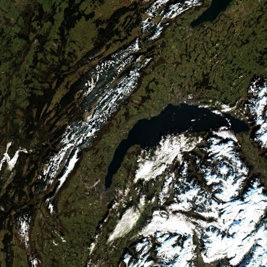
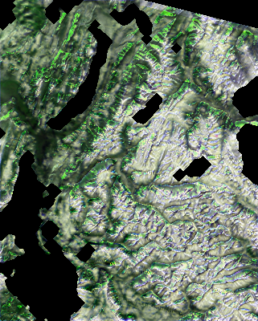
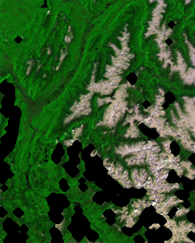
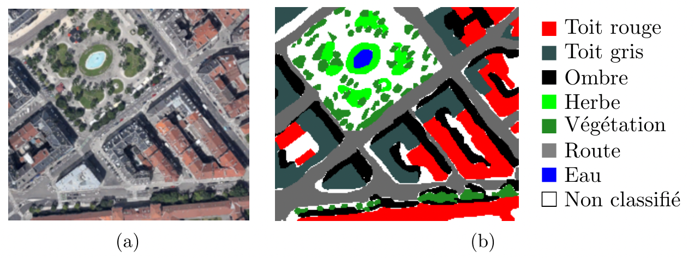
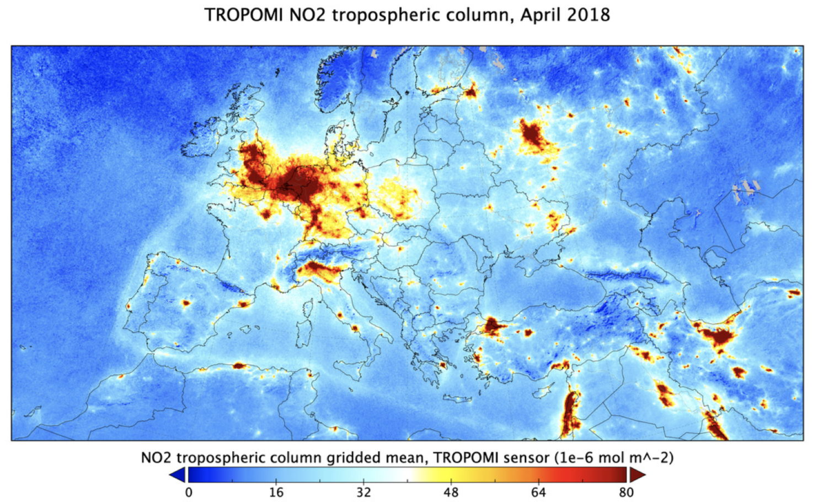
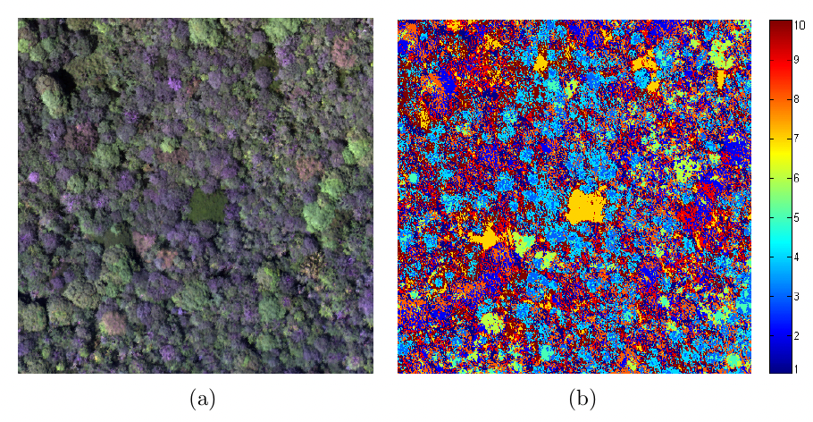
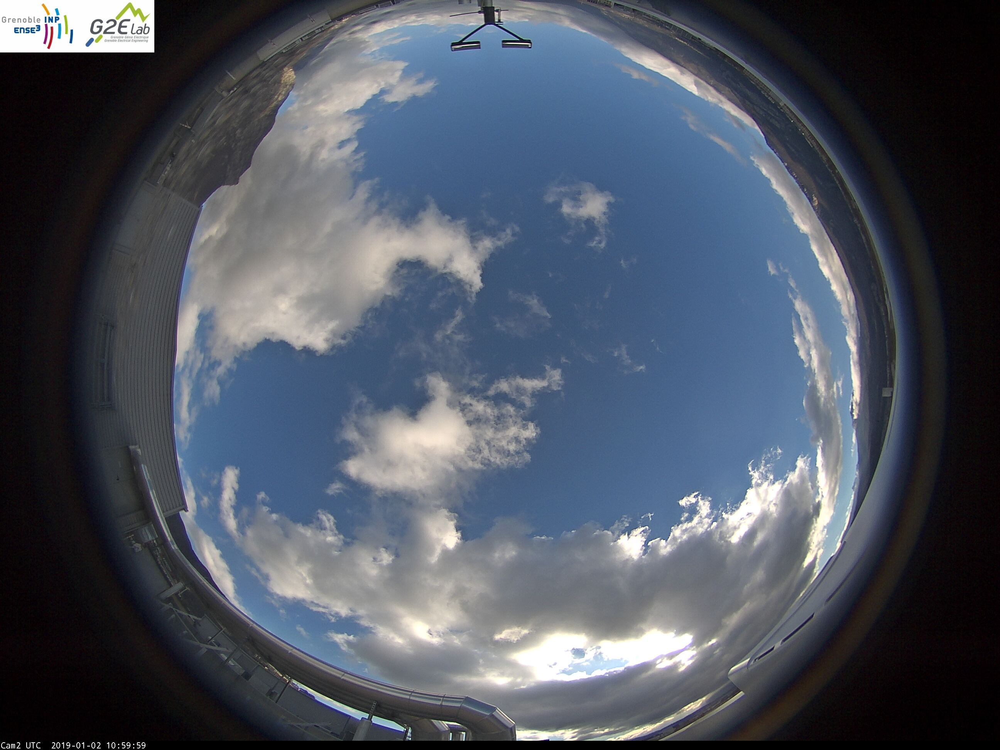
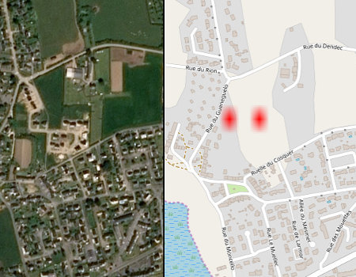

# Remote Sensing Projects
Remote Sensing Projects at ENSE3, Grenoble-INP.

## Announcements
Announcements will be posted here.

  * **Welcome to the remote sensing project**

  * Contacts
    * Aurélien Godet <aurelien.godet@gipsa-lab.grenoble-inp.fr>
    * Daniele Picone <daniele.picone@grenoble-inp.fr>
  
  * Important dates:
    * Intermediate presentation - 5 min pitch (3 slides): To be announced
    * Final presentation (15 min presentation + 5-10 min Q&A): To be announced


## Course information
### Introduction
Remote sensing refers to the analysis of images and signals acquired
over a physical phenomenon in order to obtain information on the surface
of the Earth (including the atmosphere and the oceans), without direct
contact with it.
Thanks to the specificities of the multiple imaging sensors (sensor with very
high spatial resolution or very high spectral resolution, radar, Lidar, etc.)
and the multiplicity of their supports (satellites in particular), remote
sensing is now widely used for problems of observation and monitoring of the
environment.

In this project, students will put into practice the knowledge acquired
in image and signal processing courses on 6 different remote sensing
applications related to the observation of the environment.

This project will be developed in python.

### Objectives of the course
The main objectives of this project are:

* Get familiar with satellite remote sensing and see more in depth an
    applications related to Earth observation
* Apply concepts of image/signal processing and data science
    (machine/deep learning) for the analysis of remote sensing images

Additionally, the student will develop the following set of acquired skills:

* Experience working on project development in a collaborative environment
* Gain experience in python programming (python and jupyter)
* Get familiar with version control (git)
* Get experience with other tools such as Markdown, LaTex, running
  scripts in the terminal.
* Work in English (at least for code development and reporting)
* Contribute to an open project


## Organization
- This project is organized into 10 session of 4 hours each.
- The students will divide in groups of 3 to 4 students and approach one of the problems described in the `Projects` section, or some new proposal, which has
to be validated by one of the supervisors.
- Each group is required to present a series of documents, as described in the `Deliverables` section.
- The deliverables have to be presented through a merge request on the central git repository (that is, the repository where this file is located); more
instructions are provided in the `Deliverables` section.
- The presence to each session is required and each absence will cause a penalization on your final score (0.25 deducted points for each missed hour).

## Getting started with your project

- Fork this repository to your own account on GRICAD
- Copy the folder of your chosen project from `projects\subject` to the one of your academic year
  (e.g. `projects\2024_2025` for 2024/2025).
- Create a virtual environment with conda (https://www.anaconda.com/docs/getting-started/miniconda/main) using your terminal:
  ```bash
  conda create --name my_env python=3.11
  conda activate my_env
  ```
- Then install all the dependencies with `pip install` once activate
- Optionally, keep track of your dependencies adding them to `pyproject.toml`

- For your structure, please follow the following format:
  - `README.md`: contains the description of the project
  - `LOG.md`: contains your names and the logs for each session
  - `src`: contains the python scripts
  - `data\raw`: contains the input data
  - `data\ouputs`: contains the processed data
  - `notebooks`: contains the jupyter notebooks
  - `reports`: contains the presentation and reports described in the deliverables section
  - `reports\figures`: contains the figures you added to your reports or presentation


## Deliverables

The project requires to hand the following material.
Note:
- Please include the names of all the members of the group.
- All the material (code included) has to be provided in English.

### Mid course deliverable
Each group has to provide a pdf for the mid-course presentation slides, which
have to include:
- A *problem statement*, that is:
  - The available resources to process;
  - The prospected geographical area and the timeslot under study
  - The desired products;
  - The methodology to achieve said products (at least in general terms);
  - The ground truth and the measures to compare to it, if applicable.
- A description of the characteristics of the available sensors, specifically:
  - The *ground sample distance* of each band;
  - The bandwidth coverage of each band;
  - Information on the orbit (revisit time, swath, etc.);
  - Possible applications linked to the sensors.
- A tutorial on how to download, geolocalize and transform the data into an array:
  - The portal used to download the data;
  - The image and metadata format;
  - Description of the scripts used.

### End course deliverable
At the final session of the course, each group has to provide:
- A notebook describing how to access the code in your project, which has to include:
  - How download the data from an online platform;
  - A data visualization, highlighting its peculiarities;
  - A script to showcase all the tested methods;
  - Tests, experiments and results comparisons
  - *NOTE:* The actual code in the notebook has to be minimal, as it has to
    just call the functions contained in your `src` folder
- A pdf for the final presentation slides, extending the mid-course one with:
  - A description of the methods
  - A visual comparison of the results
- A final report written in LaTex, which details all the work done during the project:
    - Sources used in your work (literature, online repositories)
    - Problem statement, with detailed formulation of the input and outputs
    - Mathematical description of the methods
    - Description of the validation framework
    - Discussion on the results:
      - Objective, through quality indices (presented through tables)
      - Qualitative, by visually comparing the results
Please follow the provided template to organize your data; the project structure is available at `projects\template\README.md`.

### Handing out your deliverables
The deliverables have to be added to your project main folder according to the
project organization described in the following section.
Henceforth, in your project folder:
- `notebooks`: has to include the Jupyter notebook of your work
- `reports`: has to contain the presentations and the final report

The deliverables are to be provided through a merge request to the central repository.

The instructions for interfacing through `git` are located in `projects\template\docs\instructions_git.md`.


## Projects
### [1 - Snow cover estimation based on remote sensing high spatial resolution images](projects/subject/01_snow_hr)



### [2 - Snow cover estimation based on remote sensing time series](projects/subject/02_snow_ts)




### [3 - Mapping the Grenoble urban environment by remote sensing](projects/subject/03_urban)



### [4 - Monitoring pollution in the atmosphere](projects/subject/04_pollution)



### [5 - Analysis of the forest around Grenoble using remote sensing imaging](projects/subject/05_forest)



### [6 - Solar irradiance estimation at GreEn-Er](projects/subject/06_irradiance)



### [7 - Urban Monitoring: Change Detection Bundle](projects/subject/07_change_detection)



### [8 - Ship detection challenge](projects/subject/08_ship_detection)


### [9 - Remote Sensing video analysis](projects/subject/09_rs_video)

<!-- blank line -->
<figure class="video_container">
  <iframe src="https://sandbox.intelligence-airbusds.com/web/assets/mp4/beach.mp4" frameborder="0" allowfullscreen="true"> </iframe>
</figure>
<!-- blank line -->


## Useful resources
- Python and Jupyter
  - <https://jakevdp.github.io/PythonDataScienceHandbook/index.html>
    - Ch 1, 2, 4 (Ipython, NumPy, Matplotlib)
    - [optional] Ch. 3, 5 (Pandas, Machine Learning)
    - [jupyter.pdf](docs/python/jupyter.pdf)
  - [optional] Tutorial on Jupyter showcasing jupyter features and installation  <https://www.youtube.com/watch?v=HW29067qVWk>
  - [optional] Video on downsides of using jupyter notebooks
  <https://www.youtube.com/watch?v=7jiPeIFXb6U>
  - conda cheatsheet <https://docs.conda.io/projects/conda/en/4.6.0/_downloads/52a95608c49671267e40c689e0bc00ca/conda-cheatsheet.pdf>

- Git
  - Introductory videos at <https://git-scm.com/videos> [~30 min in total]

## Coordinator
  - Mauro Dalla Mura (2016-)
## Supervisors
  - Aurélien Godet (2025)
  - Daniele Picone (2021-2022/2025)
  - Mohamad Jouni (2022-2024)
  - Chloé Poulic (2024)
  - Matthieu Muller (2022-2023)
  - Mauro Dalla Mura (2016-2021)
  - Giuseppe Costantino (2021-2022)
  - Aneline Dolet (2019-2021)
  - Théo Masson (2017-2018)
  - Guillaume Tochon (2016)
